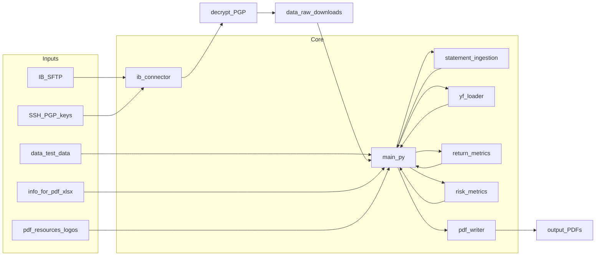

# Gaard Reporting System

Generates quarterly portfolio PDF reports from Interactive Brokers Flex Query CSVs, using Yahoo Finance for benchmark and security reference data.

## Prerequisites

- Python 3.x
- Install dependencies: `pip install -r requirements.txt` (from the project root)
- **GnuPG** (`gpg`) on your PATH — PGP decryption in `ib_connector` shells out to GnuPG
- Run the program **from the `src` directory** so local imports resolve

## Quick start

```bash
# 1. Create and activate a virtual environment
python3 -m venv .venv
source .venv/bin/activate        # macOS / Linux
# .venv\Scripts\activate         # Windows

# 2. Install dependencies
pip install -r requirements.txt

# 3. Run the report pipeline
cd src
python main.py
```

PDFs are written to **`output/`** with names like `{AccountTitle}_Quarter_Portfolio_Report_{YYYYMMDD_HHMM}.pdf`.

## Using the switchboard

All runtime options you normally change live in **`src/main.py`**, in the block labeled **`SWITCHBOARD`** (at the top of the file, after the imports). Set these values, save the file, then run `main` (see [Quick start](#quick-start)).

### 1. Page visibility

Each `show_page_*` variable is a boolean: `True` includes that section in the PDF, `False` skips it.

| Variable | Purpose |
|----------|---------|
| `show_page_cover` | Cover page |
| `show_page_table_of_contents` | Table of contents |
| `show_page_goals_and_objectives` | Goals and objectives |
| `show_page_target_allocations` | Target allocations |
| `show_page_breakdown_of_accounts` | Breakdown of accounts (**consolidated reports only**) |
| `show_page_change_in_portfolio_value` | Change in portfolio value |
| `show_page_portfolio_overview` | Portfolio overview |
| `show_page_portfolio_performance` | Portfolio performance |
| `show_page_expanded_performance` | Expanded performance |
| `show_page_risk_analysis` | Risk analysis |
| `show_page_financial_statistics` | Financial statistics |
| `show_page_macro_views` | Macro views |
| `show_page_market_review` | Market review |
| `show_page_disclosures` | Disclosures |
| `show_page_end_cover` | End cover |

### 2. Per-client benchmark allocation

- **`CLIENT_BENCHMARK_OVERRIDES`** — Dictionary mapping a **substring** of the account name (case-insensitive) to a tuple `(SPY_weight, AGG_weight)`. The two weights **must sum to 1.0**.
- **`DEFAULT_BENCHMARK_RATIO`** — `(SPY, AGG)` tuple used when no override key matches the account name.

Client names are resolved with both exact substring matching and fuzzy keyword patterns (defined in `_CLIENT_FUZZY_PATTERNS`) so that variations like "John Mattox" (missing middle initial) still match correctly.

### 3. Per-client PDF content overrides

The Excel file `data/info_for_pdf.xlsx` supports an **`account`** column alongside the existing `key` / `value` columns. Rows without an `account` value apply to all reports (global defaults). Rows with an `account` value (matched via case-insensitive substring or fuzzy pattern against the account title) override the global value for that specific client's PDF. This lets you customize goals, objectives, and other copy per client.

### 4. Report type filter

**`REPORT_TYPE`** controls which accounts get a report:

| Value | Effect |
|-------|--------|
| `'both'` | Individual (IBKR `U…` accounts) and consolidated (`CONSOL_…`) |
| `'individual'` | Only individual accounts |
| `'consolidated'` | Only consolidated accounts |

### 5. Data source

**`USE_TEST_DATA`**

- `False` (default for production): Connect to IBKR SFTP, download encrypted files, decrypt with PGP, and read decrypted CSVs from `data/raw_downloads/`.
- `True`: Skip SFTP. Scan **`data/test_data/`** for subfolders whose names indicate **inception** vs **quarterly** data (see `scan_test_data_folder` in `main.py`), and use the CSVs inside those folders.

### 6. SFTP and PGP connection

| Setting | Purpose |
|---------|---------|
| `IB_SFTP_HOST` | IBKR SFTP hostname |
| `IB_USERNAME` | SFTP username |
| `REMOTE_STATEMENT_DIR` | Remote directory to download from (e.g. `outgoing`) |
| `SSH_PRIVATE_KEY_PATH` | Path to SSH private key file |
| `SSH_PUBLIC_KEY_PATH` | Path to SSH public key file |
| `PGP_PRIVATE_KEY_PATH` | Path to PGP private key file |
| `PGP_PUBLIC_KEY_PATH` | Path to PGP public key file |
| `PGP_PASSPHRASE` | Passphrase for the PGP private key, or `None` if none |

Update the key paths to match **your machine** (the repo ships with example absolute paths). **These files are sensitive**; they are excluded from version control via `.gitignore`.

### 7. Benchmark definitions

- **`BENCHMARK_CONFIG`** — For each asset class key, a list of ETF tickers used as benchmarks in allocation-style tables (e.g. `'U.S. Equities': ['SPY']`).
- **`BENCHMARK_NAMES`** — Display names for tickers (used in the PDF).

### 8. Ticker filters

- **`IGNORE_EXACT`** — Ticker strings to drop from holdings (case-insensitive **exact** match), e.g. aggregate cash lines.
- **`IGNORE_STARTSWITH`** — Any holding whose ticker **starts with** one of these strings is excluded (e.g. specific Treasury CUSIP prefixes).

---

## Report pipeline overview

The pipeline runs in four stages for **each** discovered account:

1. **Data Acquisition** — Either pull from IBKR SFTP (download → PGP decrypt → unzip) or read from local `data/test_data/`. Account pairing is date-aware: the system reads each CSV's analysis period end date and matches the inception file whose end date best covers the quarterly file.
2. **Ingestion & Classification** — Parse quarterly and since-inception CSVs, extract holdings, key statistics, daily return history, and legal notes. Auto-classify each ticker into asset classes using hardcoded mappings and keyword heuristics. Fetch official security names from Yahoo Finance.
3. **Market Data & Metrics** — Fetch benchmark returns from Yahoo Finance. Compute composite benchmark blend per the client's allocation ratio. Calculate trailing period returns (Quarter, YTD, 1Y, 3Y, Inception), risk metrics (idiosyncratic risk, R-squared, factor betas), and Contribution to Return (CTR) per asset class.
4. **PDF Generation** — Render a multi-page branded report via `fpdf2` with Altair charts, controlled by `page_visibility`. Per-page disclosure text is generated dynamically from the benchmark composition.

---

## System map

High-level flow from data fetch through PDF output:



### Root

| Artifact | Role | What you can do |
|----------|------|-----------------|
| [requirements.txt](requirements.txt) | Python package dependencies (`pandas`, `yfinance`, `fpdf2`, `altair`, `paramiko`, `python-gnupg`, `scipy`, `openpyxl`, etc.) | Add or pin versions when upgrading tooling |

### `src/` — Python modules

| File | Role | What you can do |
|------|------|-----------------|
| [src/main.py](src/main.py) | Entry point: switchboard, account discovery with date-aware pairing, per-client benchmark resolution (exact + fuzzy matching), per-client pdf_info overrides, orchestrates ingest → market data → metrics → PDF per account | Edit **SWITCHBOARD**; extend `auto_classify_asset` for classification rules; add entries to `CLIENT_BENCHMARK_OVERRIDES` and `_CLIENT_FUZZY_PATTERNS` for new clients |
| [src/ib_connector.py](src/ib_connector.py) | SFTP download from IBKR; PGP decrypt; unzip when needed; writes under `data/raw_encrypted_downloads` and `data/raw_downloads` | Adjust remote paths or diagnostics if SFTP layout changes |
| [src/statement_ingestion.py](src/statement_ingestion.py) | Parses Flex Query CSVs: holdings with per-symbol contributions, consolidated breakdown rows, key statistics, legal notes; `parse_since_inception_csv` for daily performance and IBKR risk measures | Update parsers if IBKR section names or structure change |
| [src/yf_loader.py](src/yf_loader.py) | Yahoo Finance: benchmark returns and security names for tickers | Change download logic or swap data source |
| [src/return_metrics.py](src/return_metrics.py) | Return math: cumulative indices, period windows (Quarter, YTD, 1Y, 3Y, Inception), composite benchmark blend, chart preparation | Adjust windows or benchmark blending |
| [src/risk_metrics.py](src/risk_metrics.py) | Risk metrics vs benchmark and factor betas (`scipy`, Yahoo risk-free proxy): idiosyncratic risk, R-squared, size/value/quality/momentum betas | Extend metrics or defaults |
| [src/pdf_writer.py](src/pdf_writer.py) | Multi-page PDF (`fpdf2`, `altair` charts); honors `page_visibility`; per-page disclosures generated dynamically from benchmark composition; CTR-based asset class performance | Layout, copy, colors, page order |
| [src/excel_writer.py](src/excel_writer.py) | Optional XLSX report (`write_portfolio_report_xlsx`) | **Not called** by the current pipeline; wire into `generate_report_for_account` if you want Excel output |
| [src/wrds_loader.py](src/wrds_loader.py) | Optional WRDS/CRSP benchmark returns | **Not used** by current `main`; integrate if replacing Yahoo for benchmarks |
| [src/statement_ingestion_old.py](src/statement_ingestion_old.py) | Legacy ingestion | Reference or remove after confirming nothing else imports it |
| [src/test_ib_connector.py](src/test_ib_connector.py) | Tests / manual checks for SFTP and PGP | Run when validating connectivity |

### `data/` — directories and static files

| Location | Role | What you can do |
|----------|------|-----------------|
| `data/Gaard_Keys/` | SSH and PGP key material (paths set on the switchboard). **Excluded from git.** | Store keys securely; point `*_PATH` variables at these files |
| `data/raw_encrypted_downloads/` | Encrypted downloads from SFTP before decryption. **Excluded from git.** | Inspect failed deliveries; clean up old files if needed |
| `data/raw_downloads/` | Decrypted CSVs (and extracted archives) used for account pairing. **Excluded from git.** | Refresh by re-running SFTP mode; or copy IBKR exports here for debugging |
| `data/test_data/` | Folder-per-run style layout for `USE_TEST_DATA = True`. Checked into git so a new developer can run the pipeline immediately. | Add subfolders with `inception` / quarterly naming per `scan_test_data_folder` |
| `data/info_for_pdf.xlsx` | PDF boilerplate (`key` / `value` / optional `account` columns, header on row 3) | Edit text values without changing code; add `account` column entries for per-client overrides |
| `data/pdf_resources/fonts/` | Carlito and Calibri fonts used by `fpdf2` | Replace or add fonts |
| `data/pdf_resources/logos/` | `gaard_logo.png`, `gaard_text_logo.png` | Replace assets to rebrand |

### `output/`

| Location | Role | What you can do |
|----------|------|-----------------|
| `output/` | Generated `*_Quarter_Portfolio_Report_*.pdf` files. **Excluded from git.** | Archive or distribute reports; delete old runs if disk space matters |

---

## Adding a new client

1. Add an entry to `CLIENT_BENCHMARK_OVERRIDES` in the switchboard with the desired SPY/AGG split.
2. Add a fuzzy pattern to `_CLIENT_FUZZY_PATTERNS` if the client's name might appear in shortened form in IBKR CSVs.
3. Optionally add per-client rows in `data/info_for_pdf.xlsx` (set the `account` column to a substring of the client's name) to customize PDF copy like goals & objectives.
4. If the client has a non-standard ticker classification, extend `auto_classify_asset`.

## Changelog (since initial release)

- **Contribution to Return (CTR)**: Asset-class performance on allocation pages now uses weighted CTR from IBKR's Performance by Symbol section, scaled to match the statement's `CumulativeReturn`. Previously showed unweighted class-level returns.
- **Per-client PDF content**: `info_for_pdf.xlsx` now supports an `account` column so goals, objectives, and other copy can differ per client.
- **Fuzzy client matching**: Benchmark resolution and pdf_info overrides use regex-based fuzzy patterns (`_CLIENT_FUZZY_PATTERNS`) in addition to substring matching, so names like "John Mattox" match "John P Mattox".
- **Consolidated report breakdown**: The "Breakdown of Accounts" page shows individual sub-accounts with beginning/ending NAV and return within a consolidated report.
- **Disclosure refinements**: Every PDF page now carries a standardized legal footer with unreconciled/unaudited language and custodian referral. Benchmark descriptions in disclosures are dynamically generated from the composite benchmark composition.
- **Date-aware account pairing**: `discover_and_pair_accounts_by_date` reads each CSV's analysis period to match inception files whose end date aligns with the quarterly file, with fallback heuristics.
- **SFTP automation**: `ib_connector.py` handles end-to-end SFTP download, SSH/PGP key verification, PGP decryption, and zip extraction with diagnostic logging.
